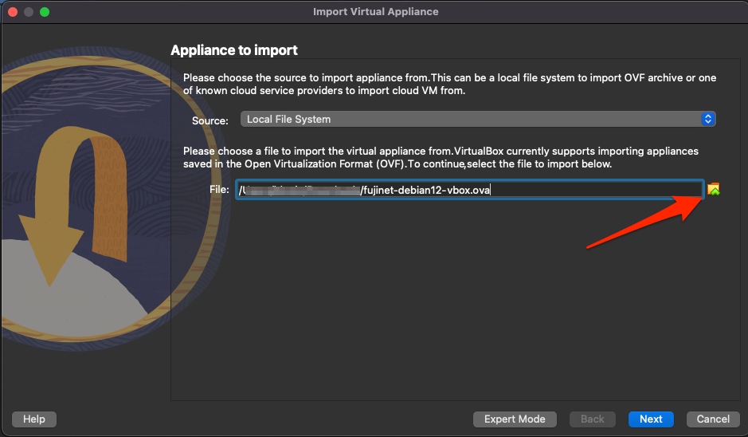

# Getting Started

## Downloading the VM

[Download VirtualMachine OVA](https://mega.nz/folder/4L03hKRL#L1GOblpv8xbHROaKIPb1xg) (this is approximately 3.6GB in size).

## Importing the VM

The results of building the Packer configuration is a VirtualBox OVA appliance VM that can be imported into VirtualBox under the `File` -> `Import Appliance...` menu.  The defaults should work fine when importing the OVA.

## Running the VM

The VM is configured to auto-login the `fujinet` user, however if there are any activities where the password is needed the following are the credentials given to the `fujinet` user:

- Username: `fujinet`
- Password: `online`

## Pre-configured Items

- Altirra - run via Wine - Starts the FujiNet-PC (`fn-pc-atari.service`) & FujiNet Emulator Bridge (`fn-emulator-bridge.service`) services automatically when started from the desktop launcher icon
- AppleWin for Linux - Starts the FujiNet-PC (`fn-pc-apple.service`) service automatically when started from the desktop launcher icon
- [fujinet-platformio](https://github.com/FujiNetWIFI/fujinet-platformio) - Git repository cloned to `$HOME/FujiNet/fujinet-platformio`
- [fujinet-apps](https://github.com/FujiNetWIFI/fujinet-apps) - Git repository cloned to `$HOME/FujiNet/fujinet-apps`

See the [FujiNet Wiki](https://github.com/FujiNetWIFI/fujinet-platformio/wiki) for more details on using FujiNet.
